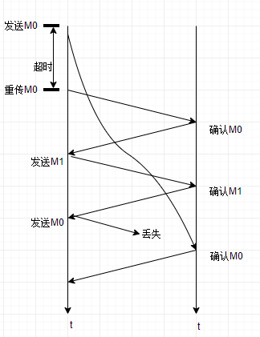
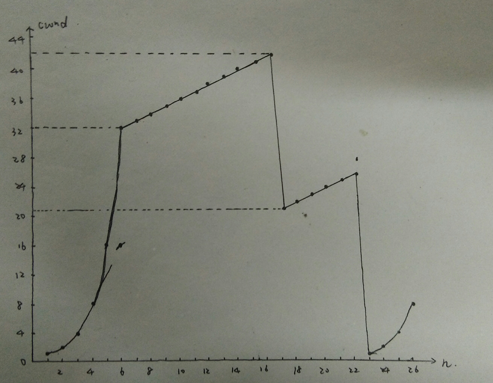
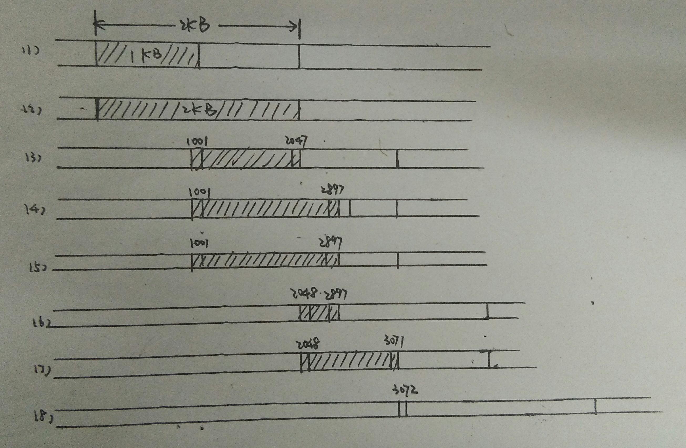

# 作业五

秦浩 17020031051 计算机科学与技术2017

**5-11** 通信的终点是应用进程，IP数据报可以找到目的主机，但是无法找到主机上的目的进程。UDP提供复用和分用功能，以及对收到的报文进行差错检测。

**5-12** 不能，因为只有具有相同标识字段值的分片才能正确组装成完整的数据报，两次传输的数据报片具有不同的标识字段值。

**5-14** 源端口1586，目的端口69，用户数据报总长度28字节，数据部分长度20字节。客户发送给服务器。服务器程序是TFTP。

**5-17** 不行，收到重复的报文段时不予理睬相当于确认丢失。B收到重复的报文段是因为A没有收到确认，它认为发送的分组丢失了，收到重复的报文段时不予理睬相当于确认丢失，如果A不断重传分组但总是收不到确认，A就认为线路通信太差，不能进行通信。

**5-18** 

**5-19** 证：假设发送窗口记为$W_T$，接收窗口记为$W_R$，使用n比特进行分组编号，假定接收窗口正好处在$2^n-1$号分组处。

则有以下三种情况：Ⅰ发送窗口$W_T$的位置不可能比以$2^n-1$号分组为第一个分组的发送窗口更靠前，Ⅱ也不可能比以$2^n-2$号分组为最后一个分组的发送窗口更靠后，Ⅲ当然也可能是一般情况：$2^n-1$号分组在发送窗口中间。

Ⅰ/Ⅱ此时在$W_T$范围内无重复序号，$W_T<=2^n$;Ⅲ$W_T+W_R<=2^n$;当$W_R=1$时$W_T<=2^n-1$。证得。

**5-21** （1）由题意知，序号4及以前的分组都已收到。两种极端情况：①已发送分组的确认均已到达发送方，此时发送窗口为$[5,7]$；②很不幸，已发送分组的确认都丢了，此时应该重发，发送窗口为$[2,4]$。所以，发送窗口可以是$[2,4],[3,5],[4,6],[5,7]$。

（2）可能有2，3，4 。这些确认分组是用来确认序号为2，3，4的分组。

**5-22**  （1）4G

（2）MSS=1460字节，4G字节数据分为2941759个数据报。总字节$4G+2941759*66=4489123390$字节，发送所需时间为$4489123390*8/10M=3424.93$秒。

**5-23** （1）30字节

（2）100

（3）80字节

（4）70

**5-27** 65535-20-20=65495字节。循环使用序号。

**5-31** L=65535 * 8+40 * 8=524600b,C=$10^9$b/s,$L/C = 5.246 * 10^{-4}$s,$T_d = 10^{-2}$s,所以最大吞吐量位$L/(L/C+2*T_d) = 25.5$Mb/s.利用率$(L/C)/(L/C+2T_d)=2.55$%。

**5-34** $RTT_{s新}=(1-α)RTT_{s旧}+αRTT_{s样本新}$。所以三次新的加权时间为29.6ms,29.84ms,29.256ms.虽然样本变化很大，但$RTT_s$变化并不大。

**5-39** (1)

(2)$[1,6],[23,26]$

(3)$[6,16],[17,22]$

(4)三个重复确认；超时检测

(5)32，21，13

(6)7

(7)4

**5-40** ①分片传输IP数据报时，其中一个数据报未按时到达，只能丢弃其余数据报；②IP数据报已到达终点，但终点缓存不足，丢弃；③数据经网桥转发时缓存不足，丢弃。

**5-61** 

**5-69** $RTT*1Gbit/s=140*10^{-3}*2^{30}bit/s$,发送给窗口至少为$140*10^{-3}*2^{30}b=18790481$字节$0.14*2^{30}/6<1G*60=7.5G字节$,需要33位序号字段。

**5-74** 流量控制是点对点通信量的控制，拥塞控制是全局性的。流量控制。